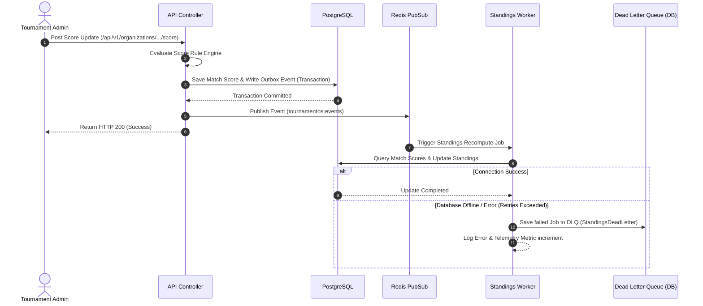

# TournamentOS SaaS Platform 🏆🛡️

**TournamentOS** is a highly resilient, event-driven multi-tenant SaaS platform built to coordinate online gaming tournaments. It handles registration workflows, match lifecycle state transitions, scoring, room allocations, standings updates, and real-time observer overlays.

---

## 📖 Table of Contents
- [1. Technical Overview](#1-technical-overview)
- [2. Comprehensive Monorepo Directory Architecture](#2-comprehensive-monorepo-directory-architecture)
  - [Backend API Modules (`apps/api`)](#backend-api-modules-appsapi)
  - [Frontend Dashboard (`apps/web`)](#frontend-dashboard-appsweb)
- [3. Core Event-Driven Flow (Mermaid Diagram)](#3-core-event-driven-flow-mermaid-diagram)
- [4. Resiliency & Consistency Controls](#4-resiliency--consistency-controls)
  - [Scope-Based Versioned Freeze Governance](#scope-based-versioned-freeze-governance)
  - [Resilient Standings Worker (Exponential Backoff, Jitter, and DLQ)](#resilient-standings-worker-exponential-backoff-jitter-and-dlq)
- [5. API Routing Directory Reference](#5-api-routing-directory-reference)
- [6. Local Development Quickstart](#6-local-development-quickstart)

---

## 1. Technical Overview

TournamentOS uses a modern, performant, and decoupled tech stack designed to ensure sub-millisecond API response times for mutations by offloading computation-heavy tasks (like standings calculations) to background worker queues.

- **Frontend**: Next.js 15 (App Router), React 19, Tailwind CSS, shadcn/ui.
- **Backend**: NestJS (v11), TypeScript, Prisma ORM, Socket.io (WebSocket Gateways).
- **Persistence**: PostgreSQL (Operational DB), Redis (Event PubSub & State Cache).

---

## 2. Comprehensive Monorepo Directory Architecture

### Backend API Modules (`apps/api`)

The backend is built as a modular NestJS application:

```tree
apps/api/src/
├── common/                     # Cross-cutting concerns
│   ├── filters/                # Global exception filters (Zod, Prisma, HTTP)
│   ├── guards/                 # Distributed Rate Limiting & Auth
│   ├── interceptors/           # Idempotency checks via Redis (duplicate submission prevention)
│   └── pipes/                  # Request payload validator (Zod)
├── modules/
│   ├── prisma/                 # Database Client configuration and lifecycle hooks
│   ├── redis/                  # Redis Publisher, Subscriber, and main connection clients
│   ├── events/                 # Event Outbox pattern and Redis PubSub channel emitter
│   ├── registration/           # Public & Admin tournament registration management
│   └── tournament/             # Core tournament rules, matches, standings, and telemetry
│       ├── engines/            # Match scoring state machines & rules engines
│       ├── gateways/           # WebSocket Server for real-time dashboard events
│       ├── policies/           # Multi-tenant scoping and mutation checks (e.g. freeze verification)
│       ├── services/           # Business logic execution & standings workers
│       └── strategies/         # Qualification rules and automated room/player allocations
└── main.ts                     # Application entry point & OpenAPI Swagger configuration
```

### Frontend Dashboard (`apps/web`)

The frontend is a single-page-feeling Next.js client utilizing responsive layout paradigms:

```tree
apps/web/src/
├── app/
│   ├── dashboard/              # Protected Route: Admin portal
│   │   ├── tournaments/        # Tournaments management list
│   │   │   ├── new/            # Campaign/Tournament creation wizard
│   │   │   └── [id]/           # Active campaign status, registrations, settings
│   │   │       ├── rooms/      # Real-time room movement, locks, scoring console
│   │   │       └── page.tsx    # Dashboard landing page for selected tournament
│   ├── tournaments/[id]/       # Public Routes
│   │   ├── register/           # Team registration landing page
│   │   └── overlays/live/      # Live WebSocket-driven match broadcast overlay
│   ├── layout.tsx              # Global context providers (QueryClient, Sockets)
│   └── page.tsx                # Client landing page
├── components/                 # Atomic UI parts (badges, tables, sidebar, forms)
├── hooks/                      # Custom hooks (e.g., useMobile reactive viewports)
└── lib/                        # API client wrappers with automated authentication
```

---

## 3. Core Event-Driven Flow

Whenever a match result is recorded, the scoring engine resolves the update instantly and offloads the standings recomputation asynchronously using a transactional Outbox pattern to prevent API blocking.



---

## 4. Resiliency & Consistency Controls

### Scope-Based Versioned Freeze Governance

Admin operations inside high-traffic tournaments can create race conditions (e.g., scoring a match while qualifying players to the next stage). TournamentOS implements a strict **Freeze Governance Model**:

- **Freeze Scopes**: Operators can freeze specific operations (`REGISTRATION`, `SCORING`, `MUTATION`).
- **Audit Consistency**: Each freeze/unfreeze updates the `freezeVersion` in the DB. Mutations must supply the `expectedVersion`. If the version has changed due to another admin unfreezing, the transaction aborts.
- **Inline Self-Healing**: To prevent a locked tournament status if the worker crashes:
  - If a transaction hits a frozen scope, it checks if `freezeExpiresAt <= now`.
  - If expired, the transaction **auto-unfreezes the tournament inline** (auto-advancing the `freezeVersion` and logging the audit event as `AUTO_EXPIRED`), then proceeds with the request immediately instead of blocking the user.

### Resilient Standings Worker (Exponential Backoff, Jitter, and DLQ)

Standings calculations are heavy database queries. When calculations fail (due to locks or database restarts), the worker handles it gracefully:
- **Exponential Backoff**: Reschedules execution with increasing delays (e.g., 5s, 10s, 20s).
- **Randomized Jitter**: Modulates the delay by a random variance (e.g., `delay = calculatedBackoff + Jitter(±2s)`) to prevent multiple nodes from executing concurrently (thundering herd).
- **Dead Letter Queue (DLQ)**: If a job fails 3 consecutive times, it is marked as failed and logged to the `StandingsDeadLetter` table. Admins can replay DLQ jobs via a dedicated REST endpoint once database/network issues are solved.

---

## 5. API Routing Directory Reference

The backend API exposes the following endpoints (available at `http://localhost:3001`):

| Scope | Method | Path | Description |
| :--- | :--- | :--- | :--- |
| **Admin** | `POST` | `/api/v1/organizations/:orgId/tournaments` | Create a new tournament |
| **Admin** | `GET` | `/api/v1/organizations/:orgId/tournaments` | List all tournaments under an organization |
| **Admin** | `PATCH` | `/api/v1/organizations/:orgId/tournaments/:id/freeze` | Freeze/unfreeze a tournament (scopes: `REGISTRATION`, `SCORING`, `MUTATION`) |
| **Admin** | `POST` | `/api/v1/organizations/:orgId/tournaments/:id/admin/recompute/replay/:deadLetterId` | Replay a failed standings job from the DLQ |
| **Admin** | `POST` | `/api/v1/organizations/:orgId/rooms/:roomId/lock` | Lock room allocations from changes |
| **Admin** | `POST` | `/api/v1/organizations/:orgId/rooms/:roomId/unlock` | Unlock room allocations |
| **Admin** | `POST` | `/api/v1/organizations/:orgId/rooms/move-team` | Move a team between rooms |
| **Admin** | `POST` | `/api/v1/organizations/:orgId/matches/:matchId/score` | Record score and enqueue standings recomputations |
| **Admin** | `POST` | `/api/v1/organizations/:orgId/stages/:stageId/qualify` | Qualify top teams to next stage |
| **Public** | `POST` | `/api/v1/tournaments/:tournamentId/register` | Register a new team |
| **Public** | `PATCH` | `/api/v1/tournaments/:tournamentId/registrations/:teamId` | Edit registration details |
| **Public** | `GET` | `/api/v1/tournaments/:tournamentId/teams/:teamId/status` | Check a team's registration/approval status |

---

## 6. Local Development Quickstart

### 1. Launch Services (PostgreSQL & Redis)
Initialize and start the portable, precompiled databases bundled with the project:

```powershell
# Start Redis server (caches event states)
.\db-services\redis\redis-server.exe .\db-services\redis\redis.windows.conf

# Start PostgreSQL server (operational database)
.\db-services\pgsql\bin\postgres.exe -D .\db-services\pgsql\data
```

### 2. Initialize Dependencies and Schema
Run this once from the root folder:

```bash
# Install node packages for monorepo
npm install

# Build database schema tables
cd apps/api
npx prisma db push
```

### 3. Run Dev Instances
From the root directory:
```bash
# Start NestJS backend (listening on localhost:3001)
npm run dev:api

# Start Next.js frontend dashboard (listening on localhost:3000)
npm run dev:web
```
